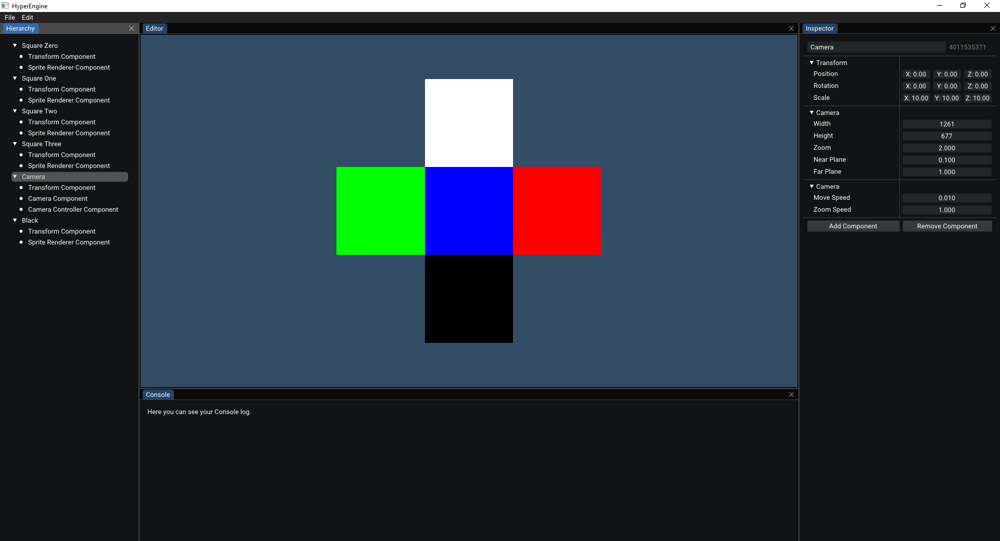



# HyperEngine

This repository houses the source code for the HyperEngine.  
The project is a cross-platform game-engine written in C++17. 
The engine can only be used on Windows and Linux as platform at the time. 
The HyperEngine has only OpenGL as backend supported in the moment.  
The goal of the project is to give the user an easy way to develop and publish games. 

## Installing and Building
In order to build the engine, you will need to follow these steps:
 1.  Start cloning the repository by typing in the command prompt of your choice: <code>git clone --recursive <a href="https://github.com/SkillerRaptor/HyperEngine">https://github.com/SkillerRaptor/HyperEngine</a></code>.
 2.  Build the project by using the `CMakeLists.txt` inside of the root directory.
 3.  Select one of the sample projects and run it to check if everything was built successfully.

## Screenshots
The following screenshots are showing features and designs from the engine:

### HyperEditor

## Dependencies
 -   [DirectXShaderCompiler](https://github.com/microsoft/DirectXShaderCompiler/blob/master/LICENSE.TXT) Copyright (c) LLVM Release License, University of Illinois 2003-2015
 -   [fmt](https://github.com/fmtlib/fmt/blob/master/LICENSE.rst) Copyright (c) MIT License, Victor Zverovich 2012-present
 -   [glad](https://github.com/Dav1dde/glad/blob/master/LICENSE) Copyright (c) MIT License, David Herberth 2013-2020
 -   [glfw](https://github.com/glfw/glfw/blob/master/LICENSE.md) Copyright (c) zlib License, Marcus Geelnard 2002-2006 & Camilla Löwy 2006-2019
 -   [glm](https://github.com/g-truc/glm/blob/master/copying.txt) Copyright (c) The Happy Bunny License, G-Truc Creation 2005
 -   [Dear ImGui](https://github.com/ocornut/imgui/blob/master/LICENSE.txt) Copyright (c) MIT License, Omar Cornut 2014-2021
 -   [ImGuizmo](https://github.com/CedricGuillemet/ImGuizmo/blob/master/LICENSE) Copyright (c) MIT License, Cedric Guillemet 2016
 -   [json](https://github.com/nlohmann/json/blob/develop/LICENSE.MIT) Copyright (c) MIT License, Niels Lohmann 2013-2021
 -   [rttr](https://github.com/rttrorg/rttr/blob/master/LICENSE.txt) Copyright (c) MIT License, Axel Menzel 2014-2018
 -   [SPIRV-Cross](https://github.com/KhronosGroup/SPIRV-Cross/blob/master/LICENSE) Copyright (c) Apache License 2.0, ARM Limited 2015-2017
 -   [stb](https://github.com/nothings/stb/blob/master/LICENSE) Copyright (c) MIT License, Sean Barrett 2017
 -   [vulkan](https://www.lunarg.com/vulkan-sdk/) Copyright (c), Khronos Group

## Contributing
Pull requests are not welcome. This project is a learning project and will be only developed by myself.
If you still would like to change something or gie some ideas, please open an issue first to discuss what you would like to change. 
The change will then reviewed and the feature will be implemented into the engine.

## License
The HyperEngine is distributed under the [MIT](https://github.com/SkillerRaptor/HyperEngine/blob/master/LICENSE) license.
