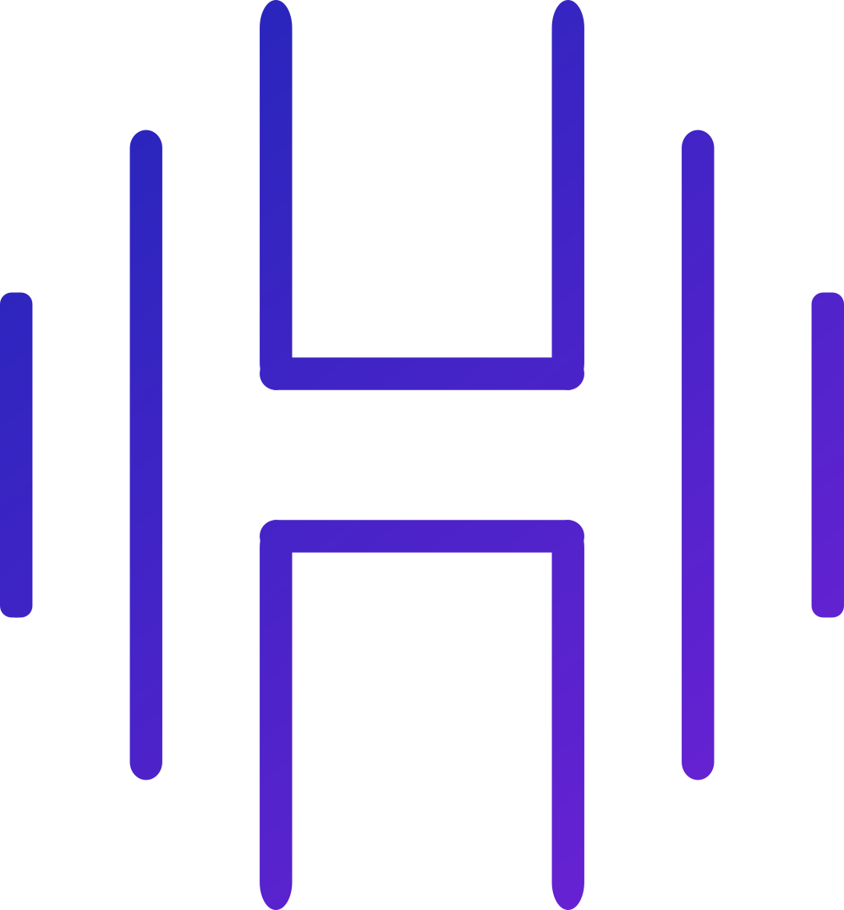



# HyperEngine

This repository houses the source code for the HyperEngine. 
The project is cross-platform graphics & game-engine written in C++17.
The engine is supporting in the moment Windows & Linux and uses in the moment OpenGL as backend. 
The goal of the project is to give the user an easy way to develop & publish games.

## Installing and Building
In order to build the engine, you will need to follow these steps:
1.  Start cloning the repository by typing in the command prompt of your choice: <code>git clone --recursive <a href="https://github.com/SkillerRaptor/HyperEngine">https://github.com/SkillerRaptor/HyperEngine</a></code>.
2.  Build the project by running the `CMakeLists.txt` inside of the root directory.
3.  Select one of the sample projects and run it to check if everything was built successfully.

## Screenshots
The following screenshots are showing features and designs from the engine:

### HyperEditor Versions

## Dependencies
-   [fmt](https://github.com/fmtlib/fmt/blob/master/LICENSE.rst) Copyright (c) MIT, Victor Zverovich 2012-present
-   [glad](https://github.com/Dav1dde/glad/blob/master/LICENSE) Copyright (c) MIT, David Herberth 2013-2020
-   [glfw](https://github.com/glfw/glfw/blob/master/LICENSE.md) Copyright (c) zlib, Camilla Löwy 2006-2019
-   [glm](https://github.com/g-truc/glm/blob/master/copying.txt) Copyright (c) The Happy Bunny License, G-Truc Creation 2005
-   [Dear ImGui](https://github.com/ocornut/imgui/blob/master/LICENSE.txt) Copyright (c) MIT, Omar Cornut 2014-2021
-   [ImGuizmo](https://github.com/CedricGuillemet/ImGuizmo/blob/master/LICENSE) Copyright (c) MIT, Cedric Guillemet 2016
-   [json](https://github.com/nlohmann/json/blob/develop/LICENSE.MIT) Copyright (c) MIT, Niels Lohmann 2013-2021
-   [rttr](https://github.com/rttrorg/rttr/blob/master/LICENSE.txt) Copyright (c) MIT, Axel Menzel 2014-2018
-   [stb_image](https://github.com/nothings/stb/blob/master/LICENSE) Copyright (c) MIT, Sean Barrett 2017

## Contributing
Pull requests are not allowed. I want this engine to be my learning project and do everything by myself.
If you still would like to change something, please open an issue first to discuss what you would like to change. 
The change will then reviewed and maybe I will implement it in the engine.

## License
The HyperEngine is distributed under the MIT [license](https://github.com/SkillerRaptor/HyperEngine/blob/master/LICENSE).
