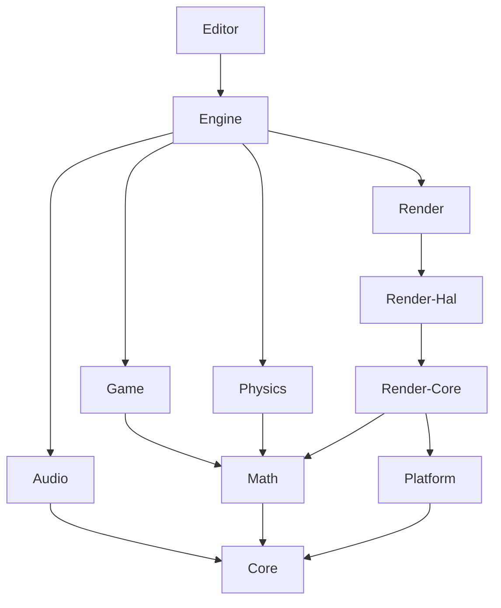

# HyperEngine Architecture

## Contents

1. [Hierarchy](#hierarchy)

## Hierarchy

```mermaid
graph TD;
    Editor-->Engine;
    Engine-->Audio;
    Engine-->Game;
    Engine-->Physics;
    Engine-->Render;

    Render-->Render-Hal;
    Render-Hal-->Render-Core;

    Game-->Math;
    Physics-->Math;
    Render-Core-->Math;

    Render-Core-->Platform;

    Audio-->Core;
    Math-->Core;
    Platform-->Core;
```
